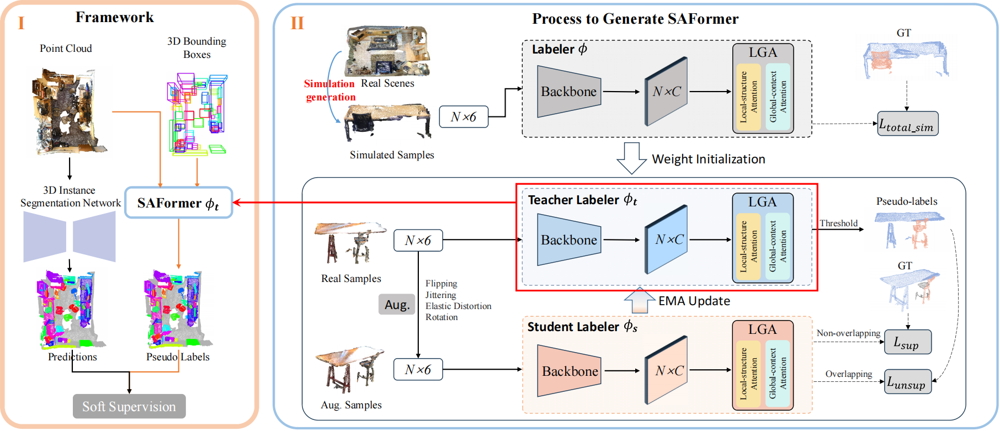

# BSNet
This is the official PyTorch implementation of **BSNet** (BSNet: Box-Supervised Simulation-assisted Mean Teacher for 3D Instance Segmentation (CVPR2024)).

**BSNet: Box-Supervised Simulation-assisted Mean Teacher for 3D Instance Segmentation (CVPR2024)** [\[Paper\]](https://openaccess.thecvf.com/content/CVPR2024/papers/Lu_BSNet_Box-Supervised_Simulation-assisted_Mean_Teacher_for_3D_Instance_Segmentation_CVPR_2024_paper.pdf)

Jiahao Lu, Jiacheng Deng, Tianzhu Zhang

<div align="center">
  
</div>

# Get Started

## Environment

Requirements

- Python 3.x
- Pytorch 1.10
- CUDA 10.x or higher

The following installation suppose `python=3.8` `pytorch=1.10` and `cuda=11.4`.

- Create a conda virtual environment

  ```
  conda create -n MMImp python=3.8
  conda activate MMImp
  ```

- Install the dependencies

  Install [Pytorch 1.10](https://pytorch.org/)

  ```
  pip install spconv-cu114
  conda install pytorch-scatter -c pyg
  pip install -r requirements.txt
  ```

  Install segmentator from this [repo](https://github.com/Karbo123/segmentator) (We wrap the segmentator in ScanNet).

- Setup, Install spformer and pointgroup_ops.

  ```
  sudo apt-get install libsparsehash-dev
  python setup.py develop
  cd spformer/lib/
  python setup.py develop
  ```

## Data Preparation

### ScanNet v2 dataset

Download the [ScanNet](http://www.scan-net.org/) v2 dataset.

Put the downloaded `scans` and `scans_test` folder as follows.

```
MMImp
├── data
│   ├── scannetv2
│   │   ├── scans
│   │   ├── scans_test
```

Split and preprocess data

```
cd data/scannetv2
bash prepare_data.sh
```

The script data into train/val/test folder and preprocess the data. After running the script the scannet dataset structure should look like below.

```
BSNet
├── data
│   ├── scannetv2
│   │   ├── scans
│   │   ├── scans_test
│   │   ├── train
│   │   ├── val
│   │   ├── test
│   │   ├── val_gt
```
## Training

### ScanNetv2
```
```

## Validation
```

```
## Pre-trained Models


| dataset | Model | AP | AP_50% | AP_25% |  Download  |
|---------------|:----:|:----:|:----:|:----:|:-----------:|
| [ScanNetv2] | SPFormer | 56.3 | 73.9 | - | [Model Weight] |
| [ScanNetv2] | ISBNet | 54.5 | 73.1 | 82.5 | [Model Weight] |
| [ScanNetv2] | MAFT | 58.4 | 75.9 | - | [Model Weight] |
| [ScanNetv2] | SPFormer + Ours | 53.3 | 72.7 | 83.4 | [Model Weight] |
| [ScanNetv2] | ISBNet + Ours | 52.8 | 71.6 | 82.6 | [Model Weight] |
| [ScanNetv2] | MAFT + Ours | 56.2 | 75.9 | 85.7 | [Model Weight] |
		

# Citation
If you find this project useful, please consider citing:


```
@inproceedings{lu2024bsnet,
  title={BSNet: Box-Supervised Simulation-assisted Mean Teacher for 3D Instance Segmentation},
  author={Lu, Jiahao and Deng, Jiacheng and Zhang, Tianzhu},
  booktitle={Proceedings of the IEEE/CVF Conference on Computer Vision and Pattern Recognition},
  pages={20374--20384},
  year={2024}
}
```
